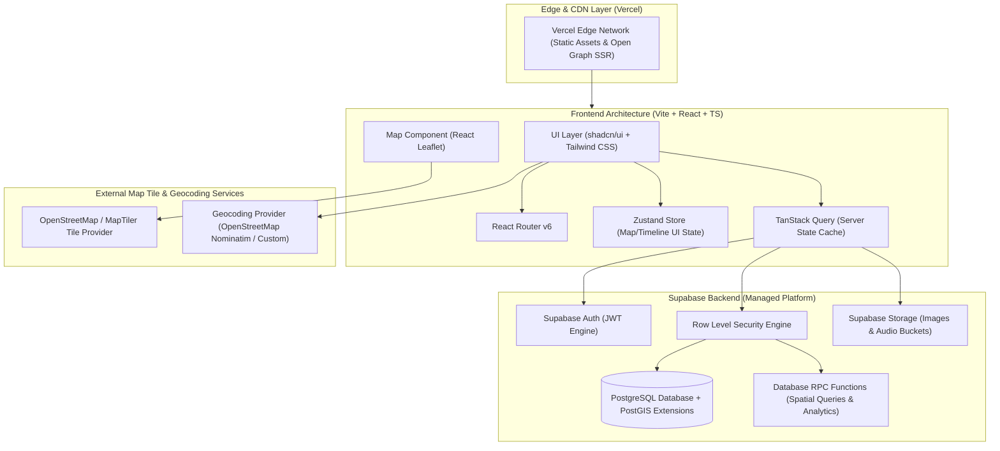

# System Architecture Document (SAD) - NaijaPins

> **Tagline:** "Where Nigeria remembers."  
> **Status:** APPROVED  
> **Target Audience:** Software Architects, Frontend/Backend Engineers, DevOps, Security Engineers  

---

## 1. System Overview & Principles

**NaijaPins** is designed as a high-performance, mobile-first, client-side rendered Web application powered by **React (Vite)** on the frontend and **Supabase (PostgreSQL + RLS + Auth + Storage)** on the backend.

### Architectural Principles
1. **Decoupled Architecture:** Clean separation between Frontend UI, Map Provider, State Management, and Data Storage. Map rendering engine (Leaflet) is isolated behind an abstraction layer to allow tile provider or mapping engine updates without rewriting business logic.
2. **Security by Default (Zero-Trust Client):** Frontend clients interact exclusively via Supabase Anon Key guarded by PostgreSQL Row Level Security (RLS). Service-role keys are strictly prohibited in browser bundles.
3. **Optimistic & Offline-Tolerant UI:** State management cleanly separates transient client UI state (Zustand) from asynchronous server data caching and synchronization (TanStack Query).
4. **Geographic Efficiency:** Bounding-box spatial queries ensure the map fetches only visible pins, enabling instant rendering even with thousands of memory pins across Nigeria.

---

## 2. System Architecture Diagram



---

## 3. Technology Stack Specification

| Tier | Technology | Purpose / Rationale |
| :--- | :--- | :--- |
| **Frontend Framework** | **React 18 + Vite** | High performance, instant HMR, modern ES build pipeline. |
| **Language** | **TypeScript 5.x** | Strict typing across API contracts, UI components, and state. |
| **Styling & UI Components**| **Tailwind CSS + shadcn/ui** | Utility-first responsive styling with accessible Radix primitives. |
| **Routing** | **React Router v6** | Declarative client-side routing and nested layouts. |
| **State Management** | **Zustand** | Lightweight, atomic client UI state management (filters, active drawers). |
| **Data Fetching & Cache** | **TanStack Query (v5)** | Cache management, optimistic updates, automatic refetching. |
| **Mapping Engine** | **Leaflet + React Leaflet** | Open-source, highly performant, zero vendor lock-in map rendering. |
| **Marker Clustering** | **Leaflet.markercluster** | Aggregates dense map pins into high-performance visual clusters. |
| **Backend & Database** | **Supabase (PostgreSQL 15+)** | Relational data integrity, native PostGIS spatial indexing, Auth, RLS. |
| **Authentication** | **Supabase Auth** | Secure JWT handling, email/password flows, session refresh. |
| **Object Storage** | **Supabase Storage** | CDN-backed S3-compatible media storage for photos and audio. |
| **Hosting & Deployment** | **Vercel** | CI/CD deployment, global edge network, preview deployments. |
| **Testing Engine** | **Vitest + RTL + Playwright**| Fast unit testing, component testing, and cross-browser E2E integration. |

---

## 4. Frontend Architecture & Directory Structure

The frontend application follows a **feature-based folder structure** to maintain strict encapsulation and domain boundaries.

```
src/
├── assets/                     # Brand logos, icons, placeholder graphics
├── components/                 # Global UI primitives & layout elements
│   ├── ui/                     # shadcn/ui components (Button, Modal, Input, Drawer)
│   ├── layout/                 # MainLayout, Header, Footer, MobileNav
│   └── feedback/               # ErrorBoundary, Toast, LoadingSpinner, EmptyState
├── config/                     # Application constants, environment configs, map presets
├── features/                   # Feature modules (Domain-driven)
│   ├── auth/                   # Auth Forms, AuthModal, ProtectedRoute, useAuth hook
│   ├── map/                    # MapView, LeafletCanvas, PinMarker, ClusterLayer, MapControls
│   ├── memory/                 # MemoryCard, MemoryDrawer, MemoryDetail, AddMemoryWizard
│   ├── timeline/               # TimelineSlider, YearSelector, EraFilter
│   ├── search/                 # SearchBar, CategoryFilter, SpatialFilter
│   ├── profile/                # UserProfileView, MemoryGrid, SettingsForm
│   └── admin/                  # ModerationTable, ReportReviewModal, AdminStats
├── hooks/                      # Shared custom React hooks (useGeolocation, useDebounce)
├── lib/                        # Third-party wrappers & singletons
│   ├── supabase/               # Supabase client singleton & helper functions
│   └── leaflet/                # Leaflet icon definitions & map utilities
├── routes/                     # React Router page definitions & route guards
├── services/                   # Data service layer (Supabase query wrappers)
├── store/                      # Zustand state stores (useMapStore, useFilterStore)
├── types/                      # TypeScript definitions (Database types, Domain models)
└── utils/                      # Formatting helpers (dates, geo-distance, string sanitization)
```

---

## 5. Backend Architecture & Database Engine

### 5.1 Supabase & PostgreSQL Infrastructure
NaijaPins leverages Supabase managed PostgreSQL with explicit PostGIS extensions (`earthdistance` / `cube` or `postgis`) for spatial coordinate calculations.

```
[ Client Request ]
       │
       ▼
[ Supabase Gateway ]
       │
       ├──► [ Supabase Auth ] ──► Validates JWT Bearer Token
       │
       └──► [ Postgres Engine ]
                 │
                 ├──► [ RLS Evaluator ] ──► Checks User ID, Role, & Table Policy
                 │
                 ├──► [ PostGIS / Spatial Index ] ──► Evaluates `ST_MakeEnvelope` or Box Query
                 │
                 └──► [ Query Execution ] ──► Returns JSON Payload to Client
```

### 5.2 Storage Architecture
Supabase Storage is partitioned into 3 isolated buckets with specific public/private permissions and size limits:

1. `memory-images`: Public read, authenticated write. Max 5MB per file. Allowed MIME: `image/jpeg`, `image/png`, `image/webp`.
2. `memory-audio`: Public read, authenticated write. Max 10MB per file. Allowed MIME: `audio/mpeg`, `audio/mp4`, `audio/aac`.
3. `avatars`: Public read, owner write. Max 2MB per file. Allowed MIME: `image/jpeg`, `image/png`, `image/webp`.

---

## 6. Mapping & Spatial Query Architecture

### 6.1 Bounding Box Query Pattern
To prevent fetching all national pins into memory at once, map pin loading is driven by the visible viewport bounding box (`northEast`, `southWest`).

```typescript
// Spatial query signature executed on map pan/zoom idle
export interface MapBounds {
  northEast: { lat: number; lng: number };
  southWest: { lat: number; lng: number };
}

// Database query filters pins strictly within bounding box
// SELECT * FROM memories_with_locations WHERE latitude BETWEEN min_lat AND max_lat AND longitude BETWEEN min_lng AND max_lng
```

### 6.2 Provider Decoupling Layer
Leaflet components render tiles via configurable OSM-compatible tile servers (e.g., OpenStreetMap standard tiles or MapTiler vector/raster tiles). The tile URL and attribution are managed centrally in `src/config/map.config.ts`, ensuring zero hardcoded provider dependencies.

---

## 7. Role-Based Access Control (RBAC) & Authorization Matrix

| Role | Browse Map & Read Memories | Create & Edit Own Memories | Report Memories | Access Admin Dashboard | Moderate Content & Suspend Users |
| :--- | :---: | :---: | :---: | :---: | :---: |
| **Visitor (Anon)** | ✅ | ❌ | ❌ | ❌ | ❌ |
| **Authenticated User**| ✅ | ✅ | ✅ | ❌ | ❌ |
| **Moderator** | ✅ | ✅ | ✅ | ✅ | ✅ |
| **Administrator** | ✅ | ✅ | ✅ | ✅ | ✅ (Includes system config) |

*Authorization is enforced at the database level using Postgres Row Level Security (RLS) policies.*

---

## 8. State Management Architecture

```
┌────────────────────────────────────────────────────────────────────────┐
│                        Zustand Store (Client UI State)                 │
│  - activeYearRange: [1970, 1990]   - selectedCategoryId: 'school'       │
│  - mapCenter: { lat, lng }         - activeMemoryId: 'mem_123' (Drawer) │
└───────────────────────────────────┬────────────────────────────────────┘
                                    │ Triggers Refetch
                                    ▼
┌────────────────────────────────────────────────────────────────────────┐
│                   TanStack Query Store (Server Data Cache)             │
│  - queryKey: ['memories', bounds, yearRange, categoryId]               │
│  - cacheTime: 10 minutes           - staleTime: 2 minutes              │
└───────────────────────────────────┬────────────────────────────────────┘
                                    │ Calls Service Layer
                                    ▼
┌────────────────────────────────────────────────────────────────────────┐
│                   Supabase PostgREST / RPC Service                     │
└────────────────────────────────────────────────────────────────────────┘
```

---

## 9. Media Processing & Upload Pipeline

1. **Selection:** User selects image/audio file in Add Memory Wizard.
2. **Client Validation:** Client checks MIME type and raw byte size.
3. **Canvas Compression (Images):** Client resizes images > 1920px max dimension and converts to `.webp` format at 82% quality using HTML5 Canvas API, reducing upload size by up to 70%.
4. **Storage Upload:** Uploaded to Supabase Storage path: `public/${user_id}/${memory_id}/${timestamp}.${ext}`.
5. **URL Reference:** Storage public URL saved into `memory_media` database table.

---

## 10. Scalability & Performance Strategy

1. **Index Optimization:** Spatial index on `(latitude, longitude)`, composite indexes on `(status, created_at)`, and full-text search indexes on `(title, story)` using Postgres `tsvector`.
2. **Database Query Pagination:** API calls for list views employ keyset pagination (`created_at < cursor`).
3. **CDN Caching:** Static frontend bundles hosted on Vercel Edge CDN with immutable cache headers.
4. **Debounced Spatial Refetch:** Map move end events are debounced by 300ms to prevent query spamming during rapid panning.
