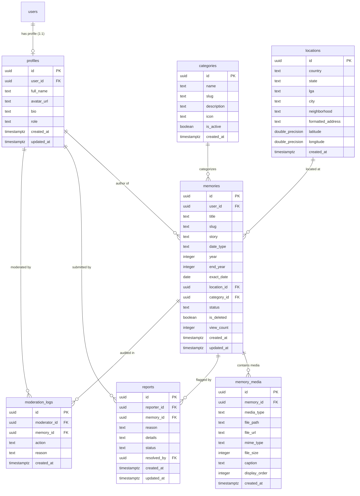

# Database Design Specification - NaijaPins

> **Tagline:** "Where Nigeria remembers."  
> **Status:** APPROVED  
> **Target Audience:** Database Engineers, Backend Engineers, Security Auditors  

---

## 1. Entity Relationship Diagram (ERD)



---

## 2. Table Schemas & DDL Definitions

### 2.1 Table: `profiles`
Stores extended user profile information linked to `auth.users`.

```sql
CREATE TYPE user_role AS ENUM ('visitor', 'authenticated_user', 'moderator', 'admin');

CREATE TABLE public.profiles (
    id UUID PRIMARY KEY DEFAULT gen_random_uuid(),
    user_id UUID UNIQUE NOT NULL REFERENCES auth.users(id) ON DELETE CASCADE,
    full_name TEXT NOT NULL CHECK (char_length(trim(full_name)) >= 2),
    avatar_url TEXT,
    bio TEXT CHECK (char_length(bio) <= 500),
    role user_role NOT NULL DEFAULT 'authenticated_user',
    created_at TIMESTAMPTZ NOT NULL DEFAULT timezone('utc'::text, now()),
    updated_at TIMESTAMPTZ NOT NULL DEFAULT timezone('utc'::text, now())
);
```

### 2.2 Table: `categories`
Stores taxonomy for memory categorization.

```sql
CREATE TABLE public.categories (
    id UUID PRIMARY KEY DEFAULT gen_random_uuid(),
    name TEXT UNIQUE NOT NULL,
    slug TEXT UNIQUE NOT NULL,
    description TEXT,
    icon TEXT NOT NULL,
    is_active BOOLEAN NOT NULL DEFAULT true,
    created_at TIMESTAMPTZ NOT NULL DEFAULT timezone('utc'::text, now())
);
```

### 2.3 Table: `locations`
Stores geographic coordinates and hierarchical address information.

```sql
CREATE TABLE public.locations (
    id UUID PRIMARY KEY DEFAULT gen_random_uuid(),
    country TEXT NOT NULL DEFAULT 'Nigeria',
    state TEXT NOT NULL,
    lga TEXT NOT NULL,
    city TEXT NOT NULL,
    neighborhood TEXT,
    formatted_address TEXT NOT NULL,
    latitude DOUBLE PRECISION NOT NULL CHECK (latitude BETWEEN -90 AND 90),
    longitude DOUBLE PRECISION NOT NULL CHECK (longitude BETWEEN -180 AND 180),
    created_at TIMESTAMPTZ NOT NULL DEFAULT timezone('utc'::text, now())
);
```

### 2.4 Table: `memories`
Core entity storing user place-based stories and dates.

```sql
CREATE TYPE memory_status AS ENUM ('draft', 'pending_review', 'published', 'rejected', 'hidden');
CREATE TYPE date_precision AS ENUM ('EXACT_DATE', 'EXACT_YEAR', 'DECADE', 'DATE_RANGE');

CREATE TABLE public.memories (
    id UUID PRIMARY KEY DEFAULT gen_random_uuid(),
    user_id UUID NOT NULL REFERENCES public.profiles(user_id) ON DELETE CASCADE,
    title TEXT NOT NULL CHECK (char_length(trim(title)) BETWEEN 5 AND 150),
    slug TEXT UNIQUE NOT NULL,
    story TEXT NOT NULL CHECK (char_length(trim(story)) >= 30),
    date_type date_precision NOT NULL DEFAULT 'EXACT_YEAR',
    year INTEGER NOT NULL CHECK (year BETWEEN 1900 AND 2100),
    end_year INTEGER CHECK (end_year >= year),
    exact_date DATE,
    location_id UUID NOT NULL REFERENCES public.locations(id) ON DELETE RESTRICT,
    category_id UUID NOT NULL REFERENCES public.categories(id) ON DELETE RESTRICT,
    status memory_status NOT NULL DEFAULT 'published',
    is_deleted BOOLEAN NOT NULL DEFAULT false,
    view_count INTEGER NOT NULL DEFAULT 0,
    created_at TIMESTAMPTZ NOT NULL DEFAULT timezone('utc'::text, now()),
    updated_at TIMESTAMPTZ NOT NULL DEFAULT timezone('utc'::text, now())
);
```

### 2.5 Table: `memory_media`
Stores photo and audio attachments for memories.

```sql
CREATE TYPE media_type AS ENUM ('image', 'audio');

CREATE TABLE public.memory_media (
    id UUID PRIMARY KEY DEFAULT gen_random_uuid(),
    memory_id UUID NOT NULL REFERENCES public.memories(id) ON DELETE CASCADE,
    media_type media_type NOT NULL,
    file_path TEXT NOT NULL,
    file_url TEXT NOT NULL,
    mime_type TEXT NOT NULL,
    file_size INTEGER NOT NULL CHECK (file_size > 0),
    caption TEXT,
    display_order INTEGER NOT NULL DEFAULT 0,
    created_at TIMESTAMPTZ NOT NULL DEFAULT timezone('utc'::text, now())
);
```

### 2.6 Table: `reports`
Stores community reports submitted for memories.

```sql
CREATE TYPE report_reason AS ENUM ('SPAM', 'HARASSMENT', 'MISINFORMATION', 'PRIVACY_VIOLATION', 'INAPPROPRIATE', 'COPYRIGHT', 'OTHER');
CREATE TYPE report_status AS ENUM ('pending', 'under_review', 'resolved_dismissed', 'resolved_removed');

CREATE TABLE public.reports (
    id UUID PRIMARY KEY DEFAULT gen_random_uuid(),
    reporter_id UUID NOT NULL REFERENCES public.profiles(user_id) ON DELETE CASCADE,
    memory_id UUID NOT NULL REFERENCES public.memories(id) ON DELETE CASCADE,
    reason report_reason NOT NULL,
    details TEXT CHECK (char_length(details) <= 1000),
    status report_status NOT NULL DEFAULT 'pending',
    resolved_by UUID REFERENCES public.profiles(user_id),
    created_at TIMESTAMPTZ NOT NULL DEFAULT timezone('utc'::text, now()),
    updated_at TIMESTAMPTZ NOT NULL DEFAULT timezone('utc'::text, now())
);
```

### 2.7 Table: `moderation_logs`
Audit trail of all administrative actions.

```sql
CREATE TABLE public.moderation_logs (
    id UUID PRIMARY KEY DEFAULT gen_random_uuid(),
    moderator_id UUID NOT NULL REFERENCES public.profiles(user_id) ON DELETE RESTRICT,
    memory_id UUID NOT NULL REFERENCES public.memories(id) ON DELETE CASCADE,
    action TEXT NOT NULL,
    reason TEXT NOT NULL,
    created_at TIMESTAMPTZ NOT NULL DEFAULT timezone('utc'::text, now())
);
```

---

## 3. Database Indexes

```sql
-- Spatial coordinates indexing for fast bounding box map queries
CREATE INDEX idx_locations_lat_lng ON public.locations(latitude, longitude);
CREATE INDEX idx_locations_state_lga ON public.locations(state, lga);

-- Memory filtering & search indexes
CREATE INDEX idx_memories_status_deleted ON public.memories(status, is_deleted) WHERE is_deleted = false;
CREATE INDEX idx_memories_location_id ON public.memories(location_id);
CREATE INDEX idx_memories_category_id ON public.memories(category_id);
CREATE INDEX idx_memories_year ON public.memories(year);
CREATE INDEX idx_memories_user_id ON public.memories(user_id);
CREATE INDEX idx_memories_slug ON public.memories(slug);

-- Full-Text Search index on Title and Story
CREATE INDEX idx_memories_fts ON public.memories USING GIN (
    to_tsvector('english', title || ' ' || story)
);

-- Media lookup index
CREATE INDEX idx_memory_media_memory_id ON public.memory_media(memory_id, display_order);
```

---

## 4. Row Level Security (RLS) Policies

### 4.1 `profiles` RLS
```sql
ALTER TABLE public.profiles ENABLE ROW LEVEL SECURITY;

-- Everyone can read profiles
CREATE POLICY "Public profiles are viewable by everyone" 
ON public.profiles FOR SELECT USING (true);

-- Users can update only their own profile
CREATE POLICY "Users can update own profile" 
ON public.profiles FOR UPDATE USING (auth.uid() = user_id);
```

### 4.2 `memories` RLS
```sql
ALTER TABLE public.memories ENABLE ROW LEVEL SECURITY;

-- Public can view published non-deleted memories
CREATE POLICY "Public memories are viewable by everyone" 
ON public.memories FOR SELECT USING (
    status = 'published' AND is_deleted = false
);

-- Authors can view their own memories regardless of status
CREATE POLICY "Authors can view own memories" 
ON public.memories FOR SELECT USING (
    auth.uid() = user_id
);

-- Authenticated users can insert memories
CREATE POLICY "Authenticated users can create memories" 
ON public.memories FOR INSERT WITH CHECK (
    auth.role() = 'authenticated' AND auth.uid() = user_id
);

-- Authors can update their own memories
CREATE POLICY "Authors can update own memories" 
ON public.memories FOR UPDATE USING (
    auth.uid() = user_id
);

-- Admins and Moderators can view and update any memory
CREATE POLICY "Moderators can view all memories" 
ON public.memories FOR SELECT USING (
    EXISTS (SELECT 1 FROM public.profiles WHERE user_id = auth.uid() AND role IN ('moderator', 'admin'))
);

CREATE POLICY "Moderators can update any memory" 
ON public.memories FOR UPDATE USING (
    EXISTS (SELECT 1 FROM public.profiles WHERE user_id = auth.uid() AND role IN ('moderator', 'admin'))
);

### 4.3 `categories` RLS
```sql
ALTER TABLE public.categories ENABLE ROW LEVEL SECURITY;

CREATE POLICY "Categories viewable by everyone" 
ON public.categories FOR SELECT USING (true);
```

### 4.4 `locations` RLS
```sql
ALTER TABLE public.locations ENABLE ROW LEVEL SECURITY;

CREATE POLICY "Locations viewable by everyone" 
ON public.locations FOR SELECT USING (true);

CREATE POLICY "Authenticated users can create locations" 
ON public.locations FOR INSERT WITH CHECK (
    auth.role() = 'authenticated'
);
```

### 4.5 `memory_media` RLS
```sql
ALTER TABLE public.memory_media ENABLE ROW LEVEL SECURITY;

CREATE POLICY "Media viewable by everyone" 
ON public.memory_media FOR SELECT USING (true);

CREATE POLICY "Authors can attach media" 
ON public.memory_media FOR INSERT WITH CHECK (
    EXISTS (SELECT 1 FROM public.memories WHERE id = memory_id AND user_id = auth.uid())
);

CREATE POLICY "Authors can delete media" 
ON public.memory_media FOR DELETE USING (
    EXISTS (SELECT 1 FROM public.memories WHERE id = memory_id AND user_id = auth.uid())
);
```

### 4.6 `reports` RLS
```sql
ALTER TABLE public.reports ENABLE ROW LEVEL SECURITY;

CREATE POLICY "Authenticated users can submit reports" 
ON public.reports FOR INSERT WITH CHECK (
    auth.role() = 'authenticated' AND auth.uid() = reporter_id
);

CREATE POLICY "Moderators can view all reports" 
ON public.reports FOR SELECT USING (
    EXISTS (SELECT 1 FROM public.profiles WHERE user_id = auth.uid() AND role IN ('moderator', 'admin'))
);

CREATE POLICY "Moderators can update reports" 
ON public.reports FOR UPDATE USING (
    EXISTS (SELECT 1 FROM public.profiles WHERE user_id = auth.uid() AND role IN ('moderator', 'admin'))
);
```

### 4.7 `moderation_logs` RLS
```sql
ALTER TABLE public.moderation_logs ENABLE ROW LEVEL SECURITY;

CREATE POLICY "Moderators can view logs" 
ON public.moderation_logs FOR SELECT USING (
    EXISTS (SELECT 1 FROM public.profiles WHERE user_id = auth.uid() AND role IN ('moderator', 'admin'))
);

CREATE POLICY "Moderators can create logs" 
ON public.moderation_logs FOR INSERT WITH CHECK (
    EXISTS (SELECT 1 FROM public.profiles WHERE user_id = auth.uid() AND role IN ('moderator', 'admin'))
);
```
```

---

## 5. Automated Triggers & Functions

### 5.1 Auto Profile Creation Trigger
```sql
CREATE OR REPLACE FUNCTION public.handle_new_user()
RETURNS TRIGGER AS $$
BEGIN
    INSERT INTO public.profiles (user_id, full_name, avatar_url)
    VALUES (
        new.id,
        COALESCE(new.raw_user_meta_data->>'full_name', 'NaijaPins Contributor'),
        new.raw_user_meta_data->>'avatar_url'
    );
    RETURN new;
END;
$$ LANGUAGE plpgsql SECURITY DEFINER;

CREATE TRIGGER on_auth_user_created
    AFTER INSERT ON auth.users
    FOR EACH ROW EXECUTE FUNCTION public.handle_new_user();
```

---

## 6. Initial Category Seed Script

```sql
INSERT INTO public.categories (name, slug, description, icon) VALUES
('Family', 'family', 'Ancestral homes, family reunions, and personal lineage milestones', 'Home'),
('School', 'school', 'Primary, secondary, and university memories, campus traditions, and alumni stories', 'GraduationCap'),
('Business', 'business', 'Historic markets, pioneer companies, local trades, and commercial legacy', 'Building2'),
('Food', 'food', 'Iconic local eateries, Bukka spots, historic food stalls, and culinary history', 'Utensils'),
('Landmark', 'landmark', 'Monuments, iconic bridges, famous public spaces, and civic architecture', 'MapPin'),
('Community', 'community', 'Neighborhood gatherings, local heroes, town hall meetings, and grassroots stories', 'Users'),
('Culture', 'culture', 'Traditional festivals, music venues, arts, language centers, and heritage', 'Palette'),
('Event', 'event', 'Notable public events, historical parades, sports matches, and political rallies', 'Calendar'),
('Historical', 'historical', 'Major historical milestones, archival photos, and documented city history', 'Scroll'),
('Personal', 'personal', 'Childhood reflections, personal journeys, romances, and personal reflections', 'Heart');
```
