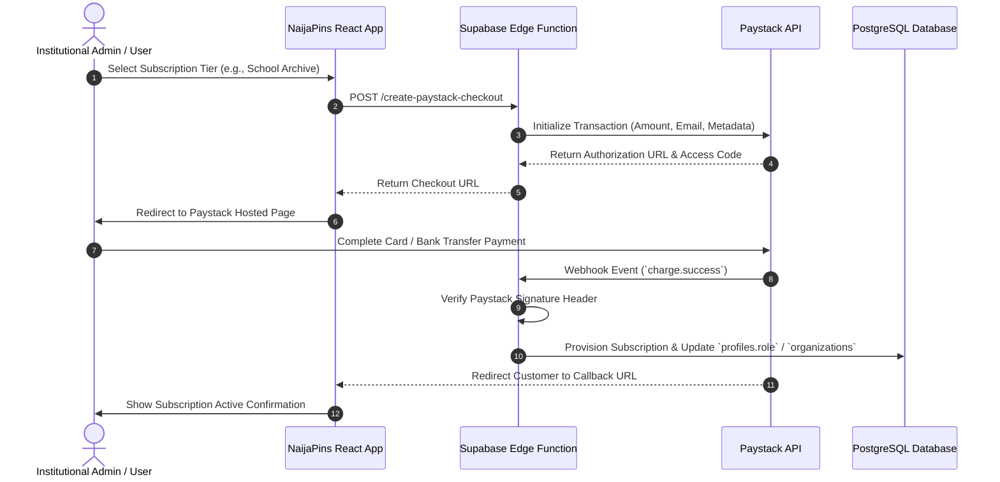

# Monetization Strategy & Business Model - NaijaPins

> **Tagline:** "Where Nigeria remembers."  
> **Status:** APPROVED  
> **Target Audience:** Business Analysts, Product Managers, Leadership, Financial Lead  

---

## 1. Monetization Philosophy & MVP Boundary

**Core Principle:** NaijaPins is first and foremost a public digital archive and community trust platform. 

During the **MVP phase**, all core discovery, mapping, memory creation, search, and sharing features are **100% FREE** for everyday citizens. Monetization features are explicitly **isolated from the MVP launch** to avoid distracting from core community engagement and network density.

```
┌────────────────────────────────────────────────────────────────────────┐
│                        PHASE 1: MVP (COMMUNITY FIRST)                  │
│   - Free Memory Pinning   - Free Audio/Photo Uploads  - Free Search     │
│   - Zero Intrusive Ads    - Zero Paywalls             - Open Archive    │
└───────────────────────────────────┬────────────────────────────────────┘
                                    │ Network Density Achieved
                                    ▼
┌────────────────────────────────────────────────────────────────────────┐
│                     PHASE 2: POST-MVP B2B & INSTITUTIONAL              │
│   - School Archives       - Museum Collections    - Heritage Brands    │
│   - Premium Family Trees  - Paystack Subscriptions- Tourism Trails     │
└────────────────────────────────────────────────────────────────────────┘
```

---

## 2. Revenue Hypotheses & Target Customer Segments

NaijaPins has identified 5 distinct revenue hypotheses to be validated sequentially post-MVP:

| Revenue Stream | Target Customer | Value Proposition | Pricing Hypothesis (NGN) |
| :--- | :--- | :--- | :--- |
| **1. Premium Family Archives** | Nigerian Families & Diaspora | Private, invite-only family memory maps, extended audio storage (up to 30 mins per story), printable physical memory map books. | ₦15,000 / year per family tree |
| **2. School & Alumni Archives** | Secondary Schools, Universities, Alumni Associations | Verified institutional badge, custom sub-domain (`unilag.naijapins.com`), dedicated alumni timeline, batch archival photo uploads. | ₦250,000 / year per institution |
| **3. Museum & Cultural Orgs** | Museums, Cultural Centers, Art Galleries | Curated heritage walking routes, audio guide QR code pins, exhibit analytics. | ₦500,000 / year per organization |
| **4. Heritage Brand Profiles** | Legacy Businesses (Banks, Historic Bakeries, Breweries, Hotels) | Verified historic business marker on interactive map, company history timeline, customer nostalgic story aggregation. | ₦100,000 / month per business branch |
| **5. Tourism & Cultural Trails** | State Tourism Boards, Tour Operators | Sponsored city heritage trails (e.g., "Historic Old Lagos Tour"), featured map placements for cultural festivals. | Project-based custom contracts (₦1M+) |

---

## 3. Paystack Integration Architecture

**Paystack** is the designated payment gateway for all future Nigerian Naira (NGN) and international card transactions.



---

## 4. Validation Milestones & Experimentation Roadmap

1. **Milestone 1 (Community Validation - Month 1 to 6):** Reach 5,000 verified public memories in Lagos without any payment prompts.
2. **Milestone 2 (Institutional Demand Test - Month 7):** Launch a "Claim Your School Heritage" landing page for 20 top alumni associations to measure willingness to pay.
3. **Milestone 3 (Paystack Beta Integration - Month 9):** Roll out Paystack checkout for the first 5 pilot schools and 10 family archives.
